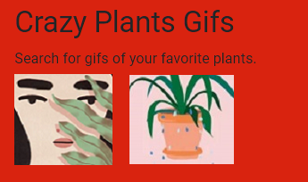
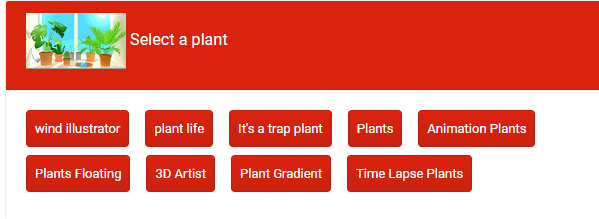
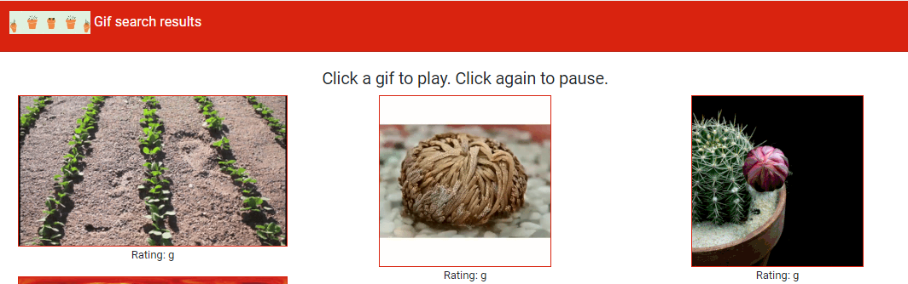

# giphyAPI

**Overview**

This website uses the GIPHY API to populate the site with gifs of your favorite crazy plants. It uses the jQuery AJAX method to perform AJAX GET requests to the query URL to get data from the GIPHY API. 

In order to make an AJAX call, a query URL needs to be constructed. The query URL consists of the host, path, search term (the name of the plant), the maximum number of gifs to be returned, and an API key. 

After the query URL is constructed, the URL is used to perform the request. When the request is complete, the site uses Javascript and jQuery to add static gif images to the HTML. You can select any plant from the completed tab buttons I had created.  

You can add new buttons by searching different types of plants, like "sunflower".  Once the buttons are clickes, the gifs show up at the bottom of the page.  Double click on any gif, and see the motion take place in the gif.  Click again, and the gif will pause.  Replay by clicking again, to see the complete dynamic feature of the gif play out. 

**Technologies/Languages Used:**

- HTML5
- CSS
- Bootstrap 4.0.0-beta
- Javascript
- JQuery
- AJAX
- GIPHY API

**Screenshots of webpage**

**Header:**

**Select a Plant:**

**Gif Search:**

